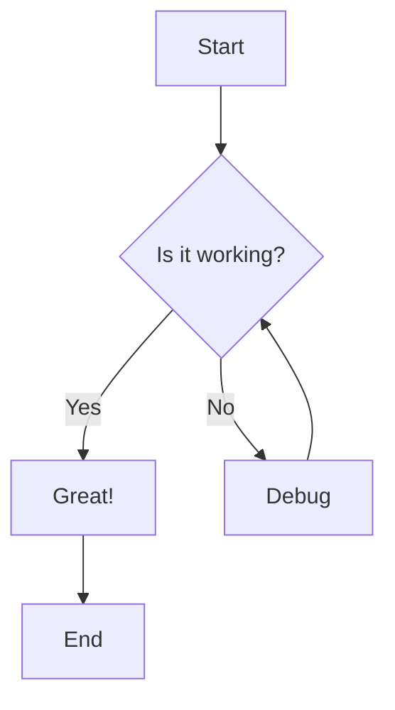
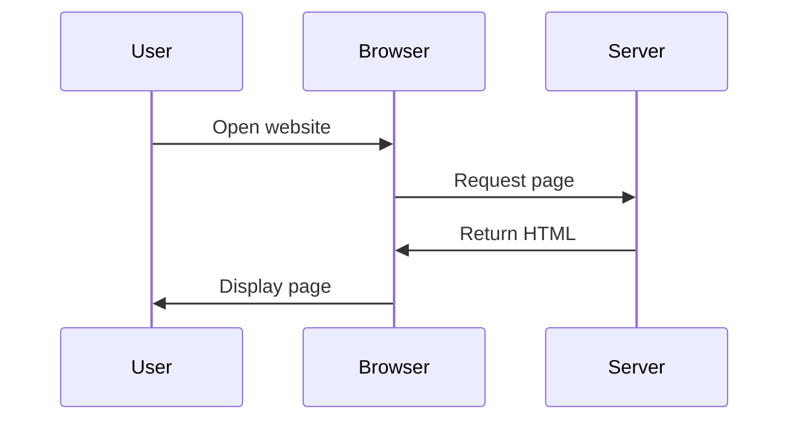
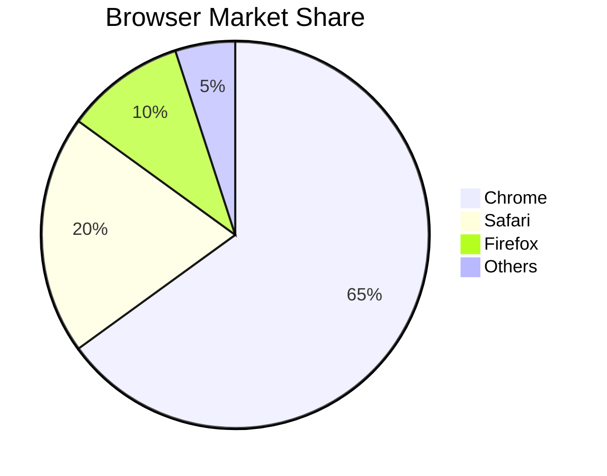
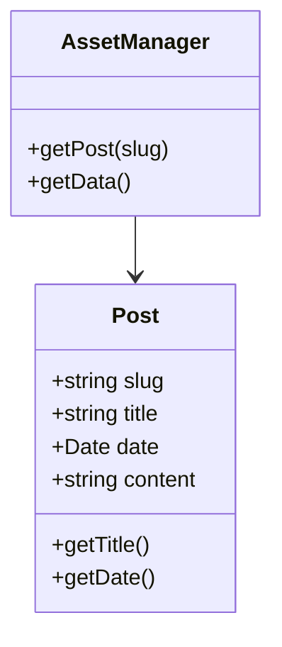

## Headers

# This is a Heading h1

## This is a Heading h2

###### This is a Heading h6

## Emphasis

_This text will be italic_
_This will also be italic_

**This text will be bold**
**This will also be bold**

_You **can** combine them_

## Lists

### Unordered

- Item 1
- Item 2
- Item 2a
- Item 2b
- Item 3a
- Item 3b

### Ordered

1. Item 1
2. Item 2
3. Item 3
4. Item 3a
5. Item 3b

## Images

Paragraph goes here


## Links

You may be using [Markdown Live Preview](https://markdownlivepreview.com/).

## Blockquotes

> Markdown is a lightweight markup language with plain-text-formatting syntax, created in 2004 by John Gruber with Aaron Swartz.
>
> > Markdown is often used to format readme files, for writing messages in online discussion forums, and to create rich text using a plain text editor.

## Tables

| Left columns | Right columns |
| ------------ | :-----------: |
| left foo     |   right foo   |
| left bar     |   right bar   |
| left baz     |   right baz   |

## Blocks of code

```javascript
let message = "Hello world";
alert(message);
```

## Inline code

This web site is using `markedjs/marked`.

## Math

### Inline Math

The quadratic formula is $x = \frac{-b \pm \sqrt{b^2 - 4ac}}{2a}$.

### Block Math

$$
\int_0^{\infty} e^{-x^2} dx = \frac{\sqrt{\pi}}{2}
$$

$$
E = mc^2
$$

## Mermaid Diagrams

### Flowchart



### Sequence Diagram



### Pie Chart



### Class Diagram


